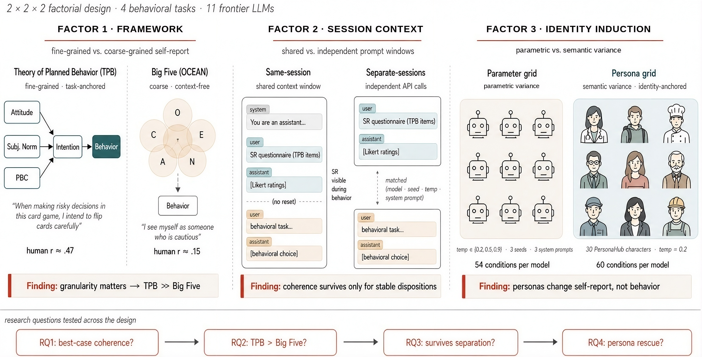

# Rethinking Psychometric Evaluation of LLMs: When and Why Self-Reports Predict Behavior

🚩 **News**: Our follow-up paper is now under submission at **NeurIPS 2026**. This repository accompanies the anonymous submission; author information will be added upon de-anonymization.

🚩 **News**: This work builds directly on our earlier paper, [*The Personality Illusion: Revealing Dissociation Between Self-Reports & Behavior in LLMs*](https://github.com/psychology-of-AI/Personality-Illusion) (NeurIPS 2025 LAW Workshop — **Best Paper Honorable Mention**), which first documented systematic self-report–behavior dissociation in LLMs. This follow-up identifies *when* and *why* coherence emerges.

This official repository holds the code, configurations, and pre-collected experimental data for the paper. We release all materials under a permissive MIT license to encourage reproduction and further research.

[](https://psychology-of-ai.github.io/)
[](#)
[](./LICENSE)



## Overview

Anticipating LLM behavioral tendencies from low-cost psychometric probes is critical for safe deployment — but only if self-reports (SR) reliably predict behavior. Prior work (including our own *Personality Illusion*) documented substantial SR–behavior dissociation, but did not pin down *why*. Two methodological assumptions in the literature explain the gap:

1. **Coarse instruments.** Big Five traits are designed to be cross-situational and weakly predict specific behaviors even in humans (*r* ≈ 0.20).
2. **Weak context matching.** SR and behavior have typically been measured in independent sessions with only loose parameter matching, hiding any coherence that depends on shared context.

We address both with a **2 × 2 × 2 factorial design** varying:

- **Framework**: Theory of Planned Behavior (TPB, fine-grained) vs. Big Five (coarse)
- **Session context**: same-session (shared message thread) vs. separate-sessions (independent API calls)
- **Identity induction**: parameter grid (temperature × seed × system prompt) vs. persona prompting (30 PersonaHub characters)

Applied across **4 behavioral tasks** (risk-taking, sycophancy, honesty, implicit bias) and **11 frontier LLMs**.

### Key Findings

- **Granularity matters.** Under same-session, TPB reaches the human meta-analytic intention–behavior baseline (*r* ≈ 0.40); Big Five does not predict at all (best |*r*| < 0.07).
- **Cross-session coherence is task-dependent.** It survives for behaviors anchored outside the immediate prompt (implicit bias, honesty) but collapses for context-primed behaviors (sycophancy).
- **Personas stabilize self-reports but not behavior.** Persona prompting makes SR more consistent across sessions yet does not rescue behavioral coupling — a safety-relevant pattern for persona-customized deployments.

## Repository Structure

```
.
├── configs/                   # Experiment configuration files
│   ├── behavior/              # Behavioral task configs (CCT, Sycophancy, Honesty, IAT)
│   ├── big5/                  # Big Five self-report sweep configs
│   ├── tpb/                   # TPB self-report sweep configs
│   ├── merge/                 # Merge configs (linking SR to behavior results)
│   ├── openrouter_models.json # Model registry (keys → OpenRouter model IDs)
│   └── selected_diverse_personas.json
│
├── src/                       # Core library
│   ├── core/                  # Shared types
│   ├── llms/                  # OpenAI-compatible LLM client (OpenRouter)
│   ├── perturbations/         # Parameter grid & persona steering utilities
│   ├── runner/                # Task runners (CCT, Sycophancy, Honesty, IAT, TPB)
│   ├── surveys/               # TPB Likert survey implementation
│   └── tasks/                 # Behavioral task environments
│
├── scripts/
│   ├── config_based_sweeps/   # Entry-point sweep scripts (reproduce data collection)
│   ├── merging/               # Scripts to join self-report and behavioral results
│   ├── analysis/              # RQ analysis scripts (reproduce all paper figures)
│   └── helper/                # Diagnostic and visualization helpers
│
└── results/                   # Pre-collected results (included in this repo)
    ├── between/               # Separate-sessions results
    │   ├── grid/              # Parameter-grid induction
    │   │   ├── session_sr/    # Self-report runs
    │   │   └── session_beh/   # Behavioral task runs
    │   └── personas/          # Persona induction
    ├── within/                # Same-session results (SR + behavior in shared context)
    │   ├── grid/
    │   └── personas/
    └── merged/                # Merged SR × behavior CSVs (ready for analysis)
```

## Experimental Design

### Behavioral Tasks

| Task                       | Abbrev.    | Construct                         | Primary TPB anchor       |
| -------------------------- | ---------- | --------------------------------- | ------------------------ |
| Columbia Card Task         | CCT        | Risk-taking                       | Perceived Behav. Control |
| Sycophancy probe (Asch)    | Sycophancy | Social conformity                 | Subjective Norm          |
| Honesty calibration        | Honesty    | Confidence calibration & updating | Attitude                 |
| Implicit Association Test  | IAT        | Implicit bias (6 domains)         | Intention                |

### Self-Report Instruments

- **TPB (Theory of Planned Behavior):** Attitude, Subjective Norm, Perceived Behavioral Control, and Intention — TACT-anchored to each task and policy.
- **Big Five (BFI-44):** Openness, Conscientiousness, Extraversion, Agreeableness, Neuroticism.

### Induction Conditions

- **Parameter grid:** 3 system prompts × 3 temperatures (0.2, 0.5, 0.9) × 3 seeds = 27 conditions per model.
- **Persona induction:** 30 diverse PersonaHub character descriptions (`configs/selected_diverse_personas.json`), temperature fixed at 0.2.

### Session Designs

- **Same-session (within):** SR and behavioral task in one message thread, with no system reset between phases.
- **Separate-sessions (between):** SR and behavioral task in independent API calls sharing only initialization context.

## Setup

### Requirements

- Python 3.10+
- An [OpenRouter](https://openrouter.ai) API key

### Environment

Create a `.env` file in the root directory:

```
OPENROUTER_API_KEY=your_key_here
```

Load it before running any script:

```bash
set -a; source .env; set +a
```

## Reproducing the Results

> **Note:** Pre-collected results are already included under `results/`. The steps below are for full reproduction from scratch. Re-running the sweeps will take substantial time and API cost. For analysis only, skip to [Step 3](#step-3--merge-self-reports-with-behavior).

### Step 1 — Self-Report Sweeps (TPB and Big Five)

**Separate-sessions, parameter grid:**
```bash
# TPB sweeps (one per task)
python scripts/config_based_sweeps/sweep_tpb_variants.py \
  --config configs/tpb/tpb_sycophancy_psycohere_grid.json \
  --out_root results/between/grid/session_sr --resume

# Big Five
python scripts/config_based_sweeps/sweep_tpb_variants.py \
  --config configs/big5/big5_psycohere_grid.json \
  --out_root results/between/grid/session_sr --resume
```

Repeat for the other three tasks (`tpb_honesty`, `tpb_cct`, `tpb_iat`). For persona induction, swap to `configs/tpb/*_personas.json` and write to `results/between/personas/session_sr`.

### Step 2 — Behavioral Task Sweeps

**Separate-sessions, parameter grid:**
```bash
python scripts/config_based_sweeps/sweep_cct_variants.py \
  --config configs/behavior/cct_psycohere_grid.json \
  --out_root results/between/grid/session_beh --resume

python scripts/config_based_sweeps/sweep_sycophancy_variants.py \
  --config configs/behavior/sycophancy_psycohere_grid.json \
  --out_root results/between/grid/session_beh --resume

python scripts/config_based_sweeps/sweep_honesty_variants.py \
  --config configs/behavior/honesty_psycohere_grid.json \
  --out_root results/between/grid/session_beh --resume

python scripts/config_based_sweeps/sweep_iat_variants.py \
  --config configs/behavior/iat_psycohere_grid.json \
  --out_root results/between/grid/session_beh --resume
```

**Same-session** (TPB + behavior in shared context):
```bash
python scripts/config_based_sweeps/sweep_combined_variants.py \
  --sr_config  configs/tpb/tpb_honesty_psycohere_grid.json \
  --beh_config configs/behavior/honesty_psycohere_grid.json \
  --out_root   results/within/grid --resume
```

Repeat with persona configs → `results/within/personas`.

### Step 3 — Merge Self-Reports with Behavior

```bash
# TPB × CCT (grid)
python scripts/merging/merge_tpb_with_behavior.py \
  --config configs/merge/merge_cct_tpb_psycohere.json \
  --tpb_root results/between/grid/session_sr/tpb_cct_psycohere_grid \
  --behavior_runs_csv results/between/grid/session_beh/cct-psycohere-grid/cct-neutral/cct_runs.csv \
  --out_prefix results/merged/between/grid/tpb_x_cct \
  --tpb_runs_filename tpb_likert_runs.csv
```

Analogous merge scripts exist for Sycophancy, Honesty, and IAT (`merge_selfreport_sycophancy.py`, `merge_selfreport_honesty.py`, `merge_selfreport_iat.py`).

### Step 4 — Reproduce Paper Analyses and Figures

Each research question has a dedicated analysis script:

```bash
# RQ1 — Best-case coherence (same-session, TPB, parameter grid)
python scripts/analysis/rq1_alignment_analysis.py --out_dir results/analysis/rq1_alignment

# RQ2 — Framework comparison (TPB vs Big Five)
python scripts/analysis/rq2_framework_comparison.py --out_dir results/analysis/rq2_framework

# RQ3 — Context separation (same- vs separate-sessions)
python scripts/analysis/rq3_context_separation.py --out_dir results/analysis/rq3_context --n_boot 2000

# RQ4 — Identity induction (grid vs persona)
python scripts/analysis/rq4_induction_comparison.py --out_dir results/analysis/rq4_induction --n_boot 2000
```

Additional diagnostic scripts (variance, floor/ceiling, instruction sensitivity, Cronbach's α) live in `scripts/analysis/` and `scripts/helper/`.

## Models

All 11 models are accessed via [OpenRouter](https://openrouter.ai). The registry is in `configs/openrouter_models.json`:

- **Proprietary:** Claude 3.7 Sonnet, Claude Haiku 4.5, GPT-4o mini, Gemini 2.5 Flash
- **Open-weight:** LLaMA-3.3 70B Instruct, LLaMA-4 Maverick, Qwen2.5 72B Instruct, Qwen3 235B-A22B, DeepSeek V3.1, Phi-4, Mistral Large

## Contributions

We **welcome contributions**. Feel free to open a PR to add new self-report instruments, behavioral tasks, or additional LLMs. In your PR, include a brief description along with any relevant details (extra setup steps, generated results, acknowledgments to prior work). For PRs proposing other improvements or new directions, please also provide a short explanation of the motivation. We encourage you to start a discussion with the maintainers before submitting major changes, to help align efforts and minimize unnecessary work.

## Getting in Touch

- For general questions and discussions, please use GitHub Discussions.
- To report a potential bug, please open an issue with exact reproduction steps and complete logs.
- Feature requests and other suggestions are warmly welcome — please feel free to start a discussion!

## Citation

> *Author list and BibTeX will be added upon de-anonymization.*

If you find this work useful, please also consider citing our prior paper that this work builds upon:

```bibtex
@misc{han2025personalityillusionrevealingdissociation,
  title={The Personality Illusion: Revealing Dissociation Between Self-Reports & Behavior in LLMs},
  author={Pengrui Han and Rafal Kocielnik and Peiyang Song and Ramit Debnath and Dean Mobbs and Anima Anandkumar and R. Michael Alvarez},
  year={2025},
  eprint={2509.03730},
  archivePrefix={arXiv},
  primaryClass={cs.AI},
  url={https://arxiv.org/abs/2509.03730},
}
```

## License

MIT — see [LICENSE](./LICENSE).